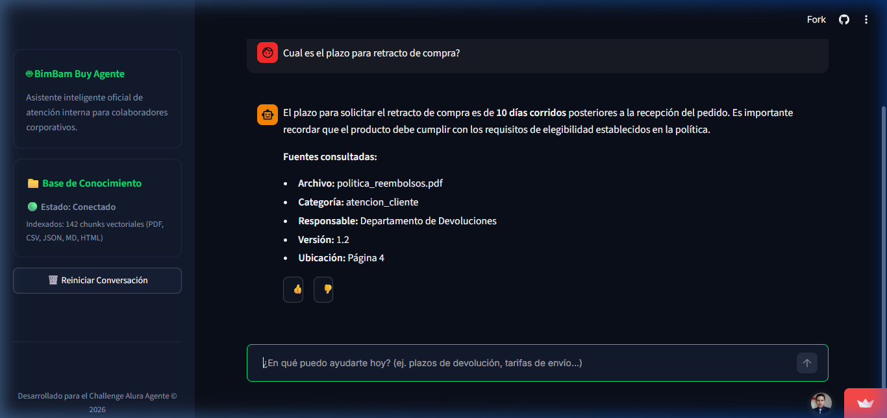

# Challenge Alura Agente - Asistente Corporativo de IA (RAG)

Este repositorio contiene la implementación del **Challenge Alura Agente**, un asistente inteligente corporativo diseñado para responder consultas de los colaboradores a partir de múltiples formatos de documentos organizacionales (PDF, CSV, JSON, Markdown, HTML). 

La solución está construida bajo una arquitectura de **Generación Aumentada por Recuperación (RAG)** con control de estado y orquestada para su despliegue en la nube de **Oracle Cloud Infrastructure (OCI)**.

---

## 🏗️ Arquitectura de la Solución

El flujo operativo del agente se divide en tres fases principales:

```
[Documentos] -> [Ingesta / Chunking] -> [Embeddings] -> [Vector DB (FAISS/Chroma)]
                                                              | (Búsqueda)
[Usuario]    -> [Consulta] -> [Agente ReAct] -> [Retrieval] --+
                                    |
                             [Respuesta + Fuentes]
```

1. **Ingesta y Procesamiento (`ingestion.py`):** Carga y limpia dinámicamente los archivos de la base de conocimiento (`documentos/`), dividiéndolos en fragmentos lógicos (*chunks*) e inyectando metadatos para trazabilidad (fuente, página/línea, categoría).
2. **Capa Vectorial (`vector_db.py`):** Convierte los fragmentos en vectores densos utilizando embeddings (Google/Hugging Face) y los almacena localmente para realizar búsquedas semánticas basadas en similitud de coseno.
3. **Capa Conversacional y Agente (`agent.py` & `app.py`):** Un agente basado en el razonamiento de acción (ReAct) de LangChain que utiliza herramientas personalizadas (`@tool`) para interrogar la base vectorial. Cuenta con memoria conversacional e interactúa a través de una interfaz interactiva en Streamlit.

---

## 🛠️ Tecnologías Utilizadas

- **Lenguaje:** Python 3.10+
- **Orquestación de IA:** LangChain & LangGraph
- **Base de Datos Vectorial:** FAISS / Chroma
- **Modelos de IA:** API de Groq con el modelo **`qwen/qwen3.6-27b`** (razonamiento ReAct) y API de Google Gemini (**`models/gemini-embedding-001`** para embeddings vectoriales)
- **Interfaz Web:** Streamlit
- **Infraestructura Cloud:** Oracle Cloud Infrastructure (OCI)

---

## 🚀 Guía de Inicio Rápido (Local)

### 1. Clonar el repositorio
```bash
git clone https://github.com/wigsdev/challenge_alura_agente.git
cd challenge_alura_agente
```

### 2. Configurar el Entorno Virtual
```bash
python -m venv .venv
# En Windows (PowerShell):
.venv\Scripts\Activate.ps1
# En Linux/macOS:
source .venv/bin/activate
```

### 3. Instalar Dependencias
```bash
pip install -r requirements.txt
```

### 4. Configurar Variables de Entorno
Crea un archivo `.env` en la raíz del proyecto a partir de `.env.example`:
```bash
GOOGLE_API_KEY=tu_api_key_de_google_aqui # Para embeddings vectoriales de FAISS
GROQ_API_KEY=tu_api_key_de_groq_aqui     # Para el agente conversacional Qwen
```

### 5. Ingesta de Documentos
Coloca tus documentos corporativos en la carpeta `documentos/` y ejecuta:
```bash
python ingestion.py
```

### 6. Ejecutar la Aplicación
```bash
streamlit run app.py
```

---

## ☁️ Despliegue en la Nube (OCI + Streamlit Cloud)

Debido a limitaciones temporales de disponibilidad de recursos gratuitos en las instancias de cómputo (VM.Standard.A1.Flex / VM.Standard.E2.1.Micro) de **Oracle Cloud Infrastructure (OCI)** en la región de Colombia Central, se optó por una **estrategia de despliegue híbrida** de nivel empresarial.

### 📐 Esquema de la Arquitectura Híbrida
```
[ OCI Object Storage ] --(Descarga Segura HTTP)--> [ App Streamlit Cloud ]
(Bucket: bimbam-buy-docs)                           (bimbambuy-agente)
                                                            |
                                                   [ Groq LPU API ]
                                                   (qwen/qwen3.6-27b)
```

### 1. Almacenamiento en OCI Object Storage
Toda la documentación corporativa oficial (el corpus de 9 archivos en formatos PDF, CSV, JSON, MD y HTML) se encuentra alojada en la nube de **Oracle Cloud (OCI)**:
* **Espacio de Nombres (Namespace):** `axfpz54f6xyw`
* **Región de OCI:** `sa-bogota-1` (Colombia Central - Bogotá)
* **Nombre del Bucket:** `bimbam-buy-docs` (Acceso público de solo lectura)
* **Formato de URL de los Objetos:** `https://objectstorage.sa-bogota-1.oraclecloud.com/n/axfpz54f6xyw/b/bimbam-buy-docs/o/<nombre_archivo>`

### 2. Frontend y Orquestación en Streamlit Cloud
La interfaz interactiva y el motor RAG están alojados en **Streamlit Community Cloud** para garantizar alta disponibilidad y despliegue rápido.
* **URL de Producción:** [https://bimbambuy-agente.streamlit.app/](https://bimbambuy-agente.streamlit.app/)
* **CI/CD:** El despliegue se sincroniza automáticamente con cada `git push` a la rama `main` de este repositorio.

### 3. Optimizaciones para Latencia y Cuotas (Migración a Groq + Qwen)
Para permitir que la aplicación funcione de manera estable en la nube sin retrasos ni fallos por cuota de uso (como el error HTTP 429), implementamos dos optimizaciones críticas:
* **Pre-Indexación Vectorial:** La base de datos vectorial FAISS se pre-compiló localmente y se subió en el repositorio (`faiss_index/`), evitando consumir la cuota de embeddings en cada arranque de la app en la nube.
* **Procesamiento Híbrido Groq (Qwen):** Migramos el procesamiento conversacional del agente ReAct a **Groq** utilizando el modelo **`qwen/qwen3.6-27b`**. Esto reduce el tiempo de respuesta del agente a menos de **1.5 segundos** por consulta, ofrece mayor robustez de razonamiento que los modelos ligeros de 8B, y cuenta con un presupuesto de tokens independiente y generoso, evitando bloqueos por IP compartida en Streamlit Cloud. La API de Google Gemini se mantiene únicamente para embeddings locales puntuales de la consulta del usuario.

### 4. Alternativa de Despliegue Persistente en VM de OCI
Si deseas realizar el despliegue directo dentro de una máquina virtual (Compute Instance) de Linux en OCI, hemos dejado en la raíz los archivos de configuración listos para producción:
* **`Dockerfile`:** Para contenerizar la aplicación con Docker en OCI.
* **`alura-agente.service`:** Archivo de servicio Systemd para mantener el servicio activo e iniciarse automáticamente con el sistema operativo de la máquina virtual.

---

## 💬 Ejemplos de Preguntas y Respuestas (QA)

A continuación se muestran ejemplos reales de interacciones con el asistente, demostrando su capacidad multi-formato y su comportamiento ante consultas fuera de contexto:

### 1. 📄 Consulta sobre Políticas de Devolución (Fuente: PDF)
* **Pregunta:** `¿Cuál es el plazo para solicitar retracto de compra?`
* **Respuesta:** 
  > El plazo para que un cliente solicite una devolución por **retracto de compra** es de **10 días corridos** posteriores a la recepción del pedido, siempre y cuando el producto cumpla con los requisitos de elegibilidad correspondientes.
  > 
  > Para cualquier duda o seguimiento adicional sobre este trámite, puedes ponerte en contacto con el **Departamento de Devoluciones**:
  > - **Correo electrónico:** `devoluciones@bimbambuy.com`
  > - **Extensión:** 201
  > 
  > **Fuentes consultadas:**
  > - **Archivo:** `politica_reembolsos.pdf` (Página 4)
  > - **Categoría:** atencion_cliente
  > - **Responsable:** Departamento de Devoluciones

### 2. 📊 Consulta sobre Tarifas de Envío (Fuente: CSV estructurado)
* **Pregunta:** `¿Cuál es el costo de envío base y el cargo adicional para la Zona Centro de México?`
* **Respuesta:**
  > Con base en las tarifas oficiales de BimBam Buy para **México (MX)**:
  > - El **costo de envío base** para la **Zona Centro** es de **$150.00 MXN**.
  > - El **cargo adicional** aplicable es de **$25.00 MXN**.
  > 
  > Si requieres soporte logístico o tienes dudas sobre coberturas adicionales, puedes contactar al **Centro de Logística y Despacho**:
  > - **Correo electrónico:** `logistica@bimbambuy.com`
  > - **Extensión:** 301
  > 
  > **Fuentes consultadas:**
  > - **Archivo:** `tarifas_envio_adicionales.csv` (Línea 2)
  > - **Categoría:** logistica
  > - **Responsable:** Centro de Logística y Despacho

### 3. 🚫 Consulta Fuera de Contexto (Mitigación de Alucinaciones - Fallback)
* **Pregunta:** `¿Cómo puedo solicitar mis días de vacaciones pendientes y en qué sistema debo registrarlos?`
* **Respuesta:**
  > Lo siento, no he encontrado información sobre políticas de vacaciones o registro de días libres en los manuales organizacionales de BimBam Buy disponibles. 
  > 
  > Para consultas sobre Recursos Humanos y beneficios para colaboradores, por favor ponte en contacto con el área de **Administración / TI**:
  > - **Correo electrónico:** `soporte_ti@bimbambuy.com`
  > - **Extensión:** 101

---

## 📸 Evidencia de Ejecución en Producción

### Aplicación Activa en Streamlit Cloud (OCI Data Ingestion)
La siguiente captura de pantalla muestra la interfaz interactiva de chat desplegada en la nube y respondiendo consultas de forma exitosa usando la base de conocimiento cargada en OCI:


